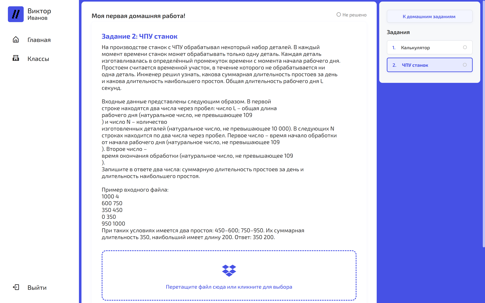

# CodeMind

Selfhosted платформа для репетиторов по информатике.



## О проекте

CodeMind позволяет автоматизировать процесс обучения, предоставляя инструменты для создания и проверки домашних заданий. С ним преподаватели смогут легко отслеживать прогресс учеников, а ученики — выполнять задания в любое время.

> На данный момент поддерживает только Python, но в будущем планируется расширение функционала.

## Функционал

* Создание неограниченного количества классов и домашних работ
* Возможность работы с несколькими преподавателями в одном классе
* Автоматическая проверка домашних заданий с помощью тестов
* Просмотр решений
* Статистика по каждому домашнему заданию

## Демо

https://github.com/user-attachments/assets/15aefe8d-3e41-45e6-a67e-e1e70d821c9d

## Установка

> [!IMPORTANT]  
> На системе должен быть установлен Docker и Docker Compose.

Введите в терминале:

```bash
git clone https://github.com/sarch-3/informatics-tutor
cd informatics-tutor
docker pull python:3.12-slim # Образ для тестированя.
```

Создайте файл `.env` на основе `.env.example` и заполните его своими данными.

Для запуска выполните из `informarics-tutor` в консоли:

```bash
docker-compose up -d
```

Теперь вы можете открыть в браузере `localhost` или ip-адрес вашего сервера и начать использовать платформу.

## Что используется

* [Django](https://www.djangoproject.com/) — для основной логики и работы с базой данных
* [FastAPI](https://fastapi.tiangolo.com/) — для тестирования домашних заданий
* [Vite + React](https://vitejs.dev/) — для фронтенда
* [PostgreSQL](https://www.postgresql.org/) — для хранения данных
* [Redis](https://redis.io/) — для кэширования и очередей задач
* [Minio](https://min.io/) — для хранения файлов
